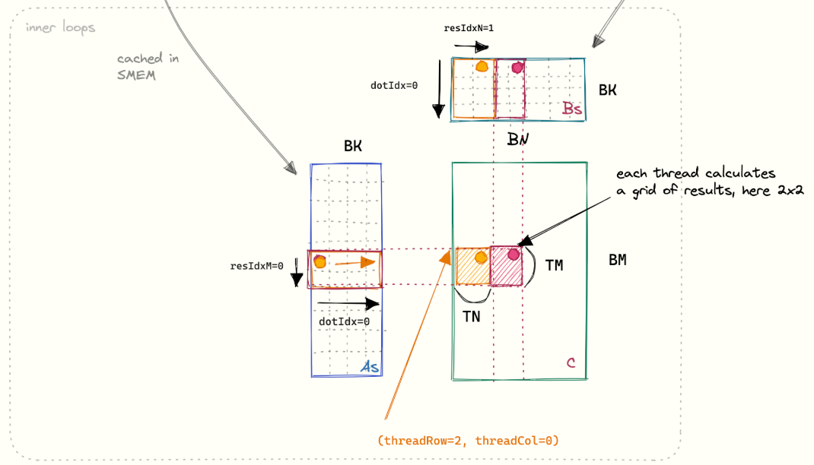
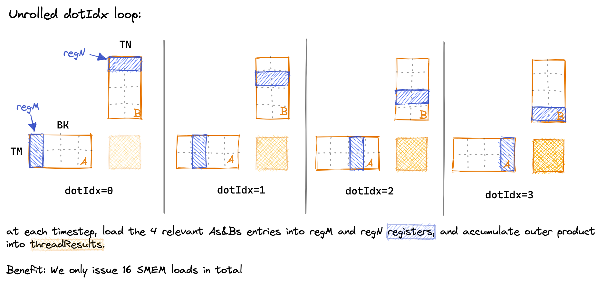

## SGEMM Optimization 策略

**单精度通用矩阵乘法 Single-precision General Matrix Multiplication** (SGEMM) 是一种非常实用且本质的矩阵乘法，但是传统的实现方式
会带来巨量的 HBM IO 和计算效率低下等问题。在现代 GPU 上已经配备了诸多优化的硬件基础，比如 **Shared Memory**, **L1 Cache**
等，如果能将
它们好好利用，将会给矩阵乘法带来巨大的吞吐量提升，而这也是优化技术如 *Flash Attention*、*fused-kernel* 的基础。

这一份笔记是对学习[矩阵优化技术](https://siboehm.com/articles/22/CUDA-MMM)的一份总结，从最简单的 naive 乘法方法开始，一步一步优化到
*cuBLAS* 的乘法实现。吞吐量可以提升 ~150×。

### sgemm-naive 最简单的矩阵乘法实现

```c++
__global__ void sgemm_naive(int M, int N, int K, float alpha, const float *A,
                            const float *B, float beta, float *C) {
  const uint x = blockIdx.x * blockDim.x + threadIdx.x;
  const uint y = blockIdx.y * blockDim.y + threadIdx.y;

  // if statement is necessary to make things work under tile quantization
  if (x < M && y < N) {
    float tmp = 0.0;
    for (int i = 0; i < K; ++i) {
      tmp += A[x * K + i] * B[i * N + y];
    }
    // C = α * (A @ B) + β * C
    C[x * N + y] = alpha * tmp + beta * C[x * N + y];
  }
}
```

这种方式最简单。优化基本没有，唯一优化的是行可以在一个warp内取连续内存，但是列是非连续的。列是最大的性能瓶颈。

### Kernel-global-memory-coalesce 全局内存合并

```c++
template <const uint BLOCKSIZE>
__global__ void sgemm_global_mem_coalesce(int M, int N, int K, float alpha,
                                          const float *A, const float *B,
                                          float beta, float *C) {
  const int cRow = blockIdx.x * BLOCKSIZE + (threadIdx.x / BLOCKSIZE);
  const int cCol = blockIdx.y * BLOCKSIZE + (threadIdx.x % BLOCKSIZE);

  // if statement is necessary to make things work under tile quantization
  if (cRow < M && cCol < N) {
    float tmp = 0.0;
    for (int i = 0; i < K; ++i) {
      tmp += A[cRow * K + i] * B[i * N + cCol];
    }
    C[cRow * N + cCol] = alpha * tmp + beta * C[cRow * N + cCol];
  }
}
```

我们这里提到一个前提，一个warp中的32个threads在定位上x依次增加，y相同。它们会做一样的事情，依次可以对内存进行访问。因此我们优化的重点在于，减少纯skipping的次数（非连续内存），转而使用连续内存。

在naive方法中，对于一个相同的iteration，一个warp中的32个threads，会对A数组进行非连续的32次访问（一列元素），而只访问到B数组的唯一元素（广播给所有threads使用）。因此性能瓶颈体现在32次非连续访问，1次访问+广播是很高效的。

对于该优化，我们可以设定一个固定大小的`BLOCKSIZE`（假设为16），通过取模和取余运算，我们可以在访问A的时候，只需要skip
2次（32/16），依次取到的元素会分别广播给16个threads使用；在访问B的时候是2次长度为16的连续内存。

本质就是：用**线程重映射**的方法，牺牲了对B的一次“广播”访问模式，换取了对A的访问模式从“灾难性的非合并”到“高效的广播”的巨大提升，同时对B的访问也演变成另一种同样高效的“合并访问”模式。

### sgemm_shared_memory_block 共享内存分片操作

```c++
template <const int BLOCKSIZE>
__global__ void sgemm_shared_mem_block(int M, int N, int K, float alpha,
                                       const float *A, const float *B,
                                       float beta, float *C) {
  // the output block that we want to compute in this threadblock
  const uint cRow = blockIdx.x;
  const uint cCol = blockIdx.y;

  // allocate buffer for current block in fast shared mem
  // shared mem is shared between all threads in a block
  __shared__ float As[BLOCKSIZE * BLOCKSIZE];
  __shared__ float Bs[BLOCKSIZE * BLOCKSIZE];

  // the inner row & col that we're accessing in this thread
  const uint threadCol = threadIdx.x % BLOCKSIZE;
  const uint threadRow = threadIdx.x / BLOCKSIZE;

  // advance pointers to the starting positions
  A += cRow * BLOCKSIZE * K;                    // row=cRow, col=0
  B += cCol * BLOCKSIZE;                        // row=0, col=cCol
  C += cRow * BLOCKSIZE * N + cCol * BLOCKSIZE; // row=cRow, col=cCol

  float tmp = 0.0;
  for (int bkIdx = 0; bkIdx < K; bkIdx += BLOCKSIZE) {
    // Have each thread load one of the elements in A & B
    // Make the threadCol (=threadIdx.x) the consecutive index
    // to allow global memory access coalescing
    As[threadRow * BLOCKSIZE + threadCol] = A[threadRow * K + threadCol];
    Bs[threadRow * BLOCKSIZE + threadCol] = B[threadRow * N + threadCol];

    // block threads in this block until cache is fully populated
    __syncthreads();
    A += BLOCKSIZE;
    B += BLOCKSIZE * N;

    // execute the dotproduct on the currently cached block
    for (int dotIdx = 0; dotIdx < BLOCKSIZE; ++dotIdx) {
      tmp += As[threadRow * BLOCKSIZE + dotIdx] *
             Bs[dotIdx * BLOCKSIZE + threadCol];
    }
    // need to sync again at the end, to avoid faster threads
    // fetching the next block into the cache before slower threads are done
    __syncthreads();
  }
  C[threadRow * N + threadCol] =
      alpha * tmp + beta * C[threadRow * N + threadCol];
}
```

这个实现起来比较麻烦，主要思想就是使用GPU的共享内存（用于块之间共享）来对矩阵A、B进行分片操作（tiling）。读取一次，然后所有运算在共享内存中进行传递，直到把输出值输入到矩阵C中。然后再将共享内存的「窗子」移动，存储并计算新的值。

GPU共享内存与L1 Cache共享，速度可以高达12TB/s，远远超过从VRAM中读取的速度，但是仍旧无法达到GPU的理论吞吐量上限。

### 1D_blocktiling 一维矩阵分块

```c++
template <const int BM, const int BN, const int BK, const int TM>
__global__ void sgemm1DBlocktiling(int M, int N, int K, float alpha,
                                   const float *A, const float *B, float beta,
                                   float *C) {
  // If we flip x and y here we get ~30% less performance for large matrices.
  // The current, 30% faster configuration ensures that blocks with sequential
  // blockIDs access columns of B sequentially, while sharing the same row of A.
  // The slower configuration would share columns of A, but access into B would
  // be non-sequential. So the faster configuration has better spatial locality
  // and hence a greater L2 hit rate.
  const uint cRow = blockIdx.y;
  const uint cCol = blockIdx.x;

  // each warp will calculate 32*TM elements, with 32 being the columnar dim.
  const int threadCol = threadIdx.x % BN;
  const int threadRow = threadIdx.x / BN;

  // allocate space for the current blocktile in SMEM
  __shared__ float As[BM * BK];
  __shared__ float Bs[BK * BN];

  // Move blocktile to beginning of A's row and B's column
  A += cRow * BM * K;
  B += cCol * BN;
  C += cRow * BM * N + cCol * BN;

  // todo: adjust this to each thread to load multiple entries and
  // better exploit the cache sizes
  assert(BM * BK == blockDim.x);
  assert(BN * BK == blockDim.x);
  const uint innerColA = threadIdx.x % BK; // warp-level GMEM coalescing
  const uint innerRowA = threadIdx.x / BK;
  const uint innerColB = threadIdx.x % BN; // warp-level GMEM coalescing
  const uint innerRowB = threadIdx.x / BN;

  // allocate thread-local cache for results in registerfile
  float threadResults[TM] = {0.0};

  // outer loop over block tiles
  for (uint bkIdx = 0; bkIdx < K; bkIdx += BK) {
    // populate the SMEM caches
    As[innerRowA * BK + innerColA] = A[innerRowA * K + innerColA];
    Bs[innerRowB * BN + innerColB] = B[innerRowB * N + innerColB];
    __syncthreads();

    // advance blocktile
    A += BK;
    B += BK * N;

    // calculate per-thread results
    for (uint dotIdx = 0; dotIdx < BK; ++dotIdx) {
      // we make the dotproduct loop the outside loop, which facilitates
      // reuse of the Bs entry, which we can cache in a tmp var.
      float tmpB = Bs[dotIdx * BN + threadCol];
      for (uint resIdx = 0; resIdx < TM; ++resIdx) {
        threadResults[resIdx] +=
            As[(threadRow * TM + resIdx) * BK + dotIdx] * tmpB;
      }
    }
    __syncthreads();
  }

  // write out the results
  for (uint resIdx = 0; resIdx < TM; ++resIdx) {
    C[(threadRow * TM + resIdx) * N + threadCol] =
        alpha * threadResults[resIdx] +
        beta * C[(threadRow * TM + resIdx) * N + threadCol];
  }
}
```



这个方法让在共享内存上更升级一步，使用到寄存器。由于每一个CUDA核心都具有寄存器，而且寄存器的速度又远快于L1
Cache或者是共享内存，因此我们可以再次降低CUDA访问SMEM的次数，转而更多使用自己的寄存器内的值。这就需要提高每一个CUDA核心的计算开销，但是我们先前的做法是「高内存开销、低核心占用」，因此我们在这里又可以让每一个CUDA核心做更多的计算，又可以把自己的寄存器使用起来，一举两得。

有趣的是每个核心的寄存器大小比SMEM更大。因此我们之前一直在注重和其他块的配合，一直没有注意到我们的CUDA核心如此强大，是时候让它发挥更多。

### 2D_blocktiling 二维矩阵分块

```c++
template <const int BM, const int BN, const int BK, const int TM, const int TN>
__global__ void __launch_bounds__((BM * BN) / (TM * TN), 1)
    sgemm2DBlocktiling(int M, int N, int K, float alpha, const float *A,
                       const float *B, float beta, float *C) {
  const uint cRow = blockIdx.y;
  const uint cCol = blockIdx.x;

  const uint totalResultsBlocktile = BM * BN;
  // A thread is responsible for calculating TM*TN elements in the blocktile
  const uint numThreadsBlocktile = totalResultsBlocktile / (TM * TN);

  // ResultsPerBlock / ResultsPerThread == ThreadsPerBlock
  assert(numThreadsBlocktile == blockDim.x);

  // BN/TN are the number of threads to span a column
  const int threadCol = threadIdx.x % (BN / TN);
  const int threadRow = threadIdx.x / (BN / TN);

  // allocate space for the current blocktile in smem
  __shared__ float As[BM * BK];
  __shared__ float Bs[BK * BN];

  // Move blocktile to beginning of A's row and B's column
  A += cRow * BM * K;
  B += cCol * BN;
  C += cRow * BM * N + cCol * BN;

  // calculating the indices that this thread will load into SMEM
  const uint innerRowA = threadIdx.x / BK;
  const uint innerColA = threadIdx.x % BK;
  // calculates the number of rows of As that are being loaded in a single step
  // by a single block
  const uint strideA = numThreadsBlocktile / BK;
  const uint innerRowB = threadIdx.x / BN;
  const uint innerColB = threadIdx.x % BN;
  // for both As and Bs we want each load to span the full column-width, for
  // better GMEM coalescing (as opposed to spanning full row-width and iterating
  // across columns)
  const uint strideB = numThreadsBlocktile / BN;

  // allocate thread-local cache for results in registerfile
  float threadResults[TM * TN] = {0.0};
  // register caches for As and Bs
  float regM[TM] = {0.0};
  float regN[TN] = {0.0};

  // outer-most loop over block tiles
  for (uint bkIdx = 0; bkIdx < K; bkIdx += BK) {
    // populate the SMEM caches
    for (uint loadOffset = 0; loadOffset < BM; loadOffset += strideA) {
      As[(innerRowA + loadOffset) * BK + innerColA] =
          A[(innerRowA + loadOffset) * K + innerColA];
    }
    for (uint loadOffset = 0; loadOffset < BK; loadOffset += strideB) {
      Bs[(innerRowB + loadOffset) * BN + innerColB] =
          B[(innerRowB + loadOffset) * N + innerColB];
    }
    __syncthreads();

    // advance blocktile
    A += BK;     // move BK columns to right
    B += BK * N; // move BK rows down

    // calculate per-thread results
    for (uint dotIdx = 0; dotIdx < BK; ++dotIdx) {
      // block into registers
      for (uint i = 0; i < TM; ++i) {
        regM[i] = As[(threadRow * TM + i) * BK + dotIdx];
      }
      for (uint i = 0; i < TN; ++i) {
        regN[i] = Bs[dotIdx * BN + threadCol * TN + i];
      }
      for (uint resIdxM = 0; resIdxM < TM; ++resIdxM) {
        for (uint resIdxN = 0; resIdxN < TN; ++resIdxN) {
          threadResults[resIdxM * TN + resIdxN] +=
              regM[resIdxM] * regN[resIdxN];
        }
      }
    }
    __syncthreads();
  }

  // write out the results
  for (uint resIdxM = 0; resIdxM < TM; ++resIdxM) {
    for (uint resIdxN = 0; resIdxN < TN; ++resIdxN) {
      C[(threadRow * TM + resIdxM) * N + threadCol * TN + resIdxN] =
          alpha * threadResults[resIdxM * TN + resIdxN] +
          beta * C[(threadRow * TM + resIdxM) * N + threadCol * TN + resIdxN];
    }
  }
}
```



到这一步的时候体现了数值优化的重要性，我们在1D优化的时候是在「线」级别的计算，寄存器每次存储一行一列算出当前的值。但是到了2D优化的时候，我们会完成「面」级别的优化。如上图所示，我们把BN、BM大小的矩阵进行逐步求outer product（相当于交叉运算），最后累积成一个「面」的内积。

我们可以做一个比较，在GPU里面，我们要尽可能增加每次读取数据之后的运算次数，因此我们考虑“计算访存比”：

> 我们选取一个 4 * 4 的tiling，TM=TN=4。我们值考虑「读取」几次，而非读取快慢。所以我们尽可能减少读取次数，增加计算出来的结果数量。 
> 
> 对于1D优化，我们计算 4 * 4 矩阵中的元素时，我们需要读取4次B（连续空间）和16次A（非连续空间），最后计算出 4 * 4 个元素。计算访存比为 16 / 20 = 0.8。
>
> 对于2D优化，我们考虑一次性计算出一个 4 * 4 矩阵，我们把tiling后的A、B矩阵元素放入`regM`和`regN`寄存器中，我们只需要读取 4 次到 regM 和 4 次 到 regN，每次计算方式为广播。计算访存比为 16 / 8 = 2.0。

### Vectorize SMEM and GMEM Accesses 向量化存储

```c++
template <const int BM, const int BN, const int BK, const int TM, const int TN>
__global__ void sgemmVectorize(int M, int N, int K, float alpha, float *A,
                               float *B, float beta, float *C) {
  const uint cRow = blockIdx.y;
  const uint cCol = blockIdx.x;

  // BN/TN are the number of threads to span a column
  const int threadCol = threadIdx.x % (BN / TN);
  const int threadRow = threadIdx.x / (BN / TN);

  // allocate space for the current blocktile in smem
  __shared__ float As[BM * BK];
  __shared__ float Bs[BK * BN];

  // Move blocktile to beginning of A's row and B's column
  A += cRow * BM * K;
  B += cCol * BN;
  C += cRow * BM * N + cCol * BN;

  // calculating the indices that this thread will load into SMEM
  // we'll load 128bit / 32bit = 4 elements per thread at each step
  const uint innerRowA = threadIdx.x / (BK / 4);
  const uint innerColA = threadIdx.x % (BK / 4);
  const uint innerRowB = threadIdx.x / (BN / 4);
  const uint innerColB = threadIdx.x % (BN / 4);

  // allocate thread-local cache for results in registerfile
  float threadResults[TM * TN] = {0.0};
  float regM[TM] = {0.0};
  float regN[TN] = {0.0};

  // outer-most loop over block tiles
  for (uint bkIdx = 0; bkIdx < K; bkIdx += BK) {
    // populate the SMEM caches
    // transpose A while loading it
    float4 tmp =
        reinterpret_cast<float4 *>(&A[innerRowA * K + innerColA * 4])[0];
    As[(innerColA * 4 + 0) * BM + innerRowA] = tmp.x;
    As[(innerColA * 4 + 1) * BM + innerRowA] = tmp.y;
    As[(innerColA * 4 + 2) * BM + innerRowA] = tmp.z;
    As[(innerColA * 4 + 3) * BM + innerRowA] = tmp.w;

    reinterpret_cast<float4 *>(&Bs[innerRowB * BN + innerColB * 4])[0] =
        reinterpret_cast<float4 *>(&B[innerRowB * N + innerColB * 4])[0];
    __syncthreads();

    // advance blocktile
    A += BK;     // move BK columns to right
    B += BK * N; // move BK rows down

    // calculate per-thread results
    for (uint dotIdx = 0; dotIdx < BK; ++dotIdx) {
      // block into registers
      for (uint i = 0; i < TM; ++i) {
        regM[i] = As[dotIdx * BM + threadRow * TM + i];
      }
      for (uint i = 0; i < TN; ++i) {
        regN[i] = Bs[dotIdx * BN + threadCol * TN + i];
      }
      for (uint resIdxM = 0; resIdxM < TM; ++resIdxM) {
        for (uint resIdxN = 0; resIdxN < TN; ++resIdxN) {
          threadResults[resIdxM * TN + resIdxN] +=
              regM[resIdxM] * regN[resIdxN];
        }
      }
    }
    __syncthreads();
  }

  // write out the results
  for (uint resIdxM = 0; resIdxM < TM; resIdxM += 1) {
    for (uint resIdxN = 0; resIdxN < TN; resIdxN += 4) {
      // load C vector into registers
      float4 tmp = reinterpret_cast<float4 *>(
          &C[(threadRow * TM + resIdxM) * N + threadCol * TN + resIdxN])[0];
      // perform GEMM update in reg
      tmp.x = alpha * threadResults[resIdxM * TN + resIdxN] + beta * tmp.x;
      tmp.y = alpha * threadResults[resIdxM * TN + resIdxN + 1] + beta * tmp.y;
      tmp.z = alpha * threadResults[resIdxM * TN + resIdxN + 2] + beta * tmp.z;
      tmp.w = alpha * threadResults[resIdxM * TN + resIdxN + 3] + beta * tmp.w;
      // write back
      reinterpret_cast<float4 *>(
          &C[(threadRow * TM + resIdxM) * N + threadCol * TN + resIdxN])[0] =
          tmp;
    }
  }
}
```

在2D的基础上进行向量化操作，因为现代GPU设计上带宽可以支持`float4`，即一次读取可以传输4个浮点数，那么每次读取内存的时候都可以连续读取128位内存。

```c++
struct __device_builtin__ __builtin_align__(16) float4
{
    float x, y, z, w;
};
```

这种写法运用到了CUDA原生的内置数据类型，同样也对程序员对内存模型提出了很高的理解要求，因为每次读取之后还会做一个转置的操作，让数据更好贴切内存结构。在计算结束之后也会需要用同样的方式以`float4`的结构发送回去。